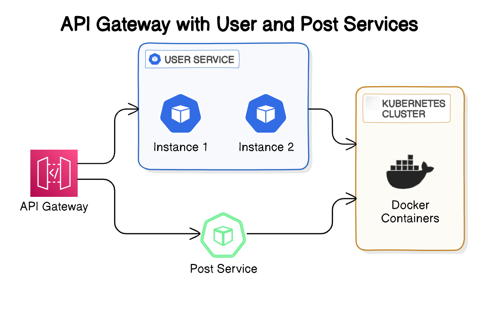

# API Gateway with User and Post Services

## Overview

In this project, I explored how to architect a microservices-based application using an API Gateway as the central access point for different services. The diagram above illustrates the key components involved in this architecture:

### Components

1. **API Gateway**:

   - The API Gateway serves as the entry point to the microservices. It handles routing, request filtering, and potentially other cross-cutting concerns like authentication and logging. The gateway directs incoming traffic to the appropriate service, either the User Service or the Post Service, based on the incoming request.

2. **User Service**:

   - The User Service is deployed with multiple instances (Instance 1 and Instance 2) to ensure high availability and load balancing. The API Gateway routes requests related to user data to these instances. This service is deployed within a Kubernetes cluster, enabling it to scale as needed and ensuring robust management of deployments.

3. **Post Service**:

   - The Post Service is another microservice that handles posts or articles within the application. Like the User Service, it is managed through Kubernetes and is containerized using Docker. The API Gateway forwards post-related requests to this service, ensuring a separation of concerns between user management and content management.

4. **Kubernetes Cluster**:

   - Both the User and Post services are deployed within a Kubernetes cluster. Kubernetes automates the deployment, scaling, and management of these containerized applications, ensuring they are resilient and scalable.

5. **Docker Containers**:
   - Docker containers are used to encapsulate each microservice, ensuring that they are portable and can run consistently across different environments. This helps to isolate the services and makes it easier to manage dependencies.

## Project Goals

The primary goal of this project was to build a microservices architecture that can scale efficiently and be resilient to failures. By using an API Gateway, I ensured that different services can be independently managed and scaled. The use of Kubernetes and Docker provides the foundation for automated deployment, scaling, and management of the services, ensuring that they are always available and can handle varying loads.

This setup also lays the groundwork for further enhancements, such as integrating authentication, monitoring, and service discovery, which can be handled through the API Gateway and Kubernetes.

## Conclusion

This project demonstrates a practical approach to building scalable and manageable microservices with an API Gateway, Kubernetes, and Docker. It showcases the benefits of containerization and orchestration in modern application development.
